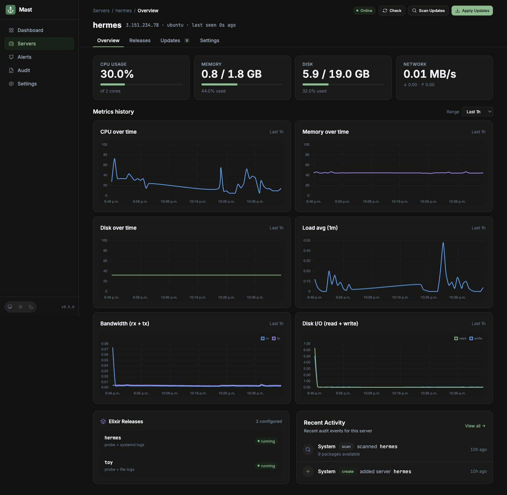
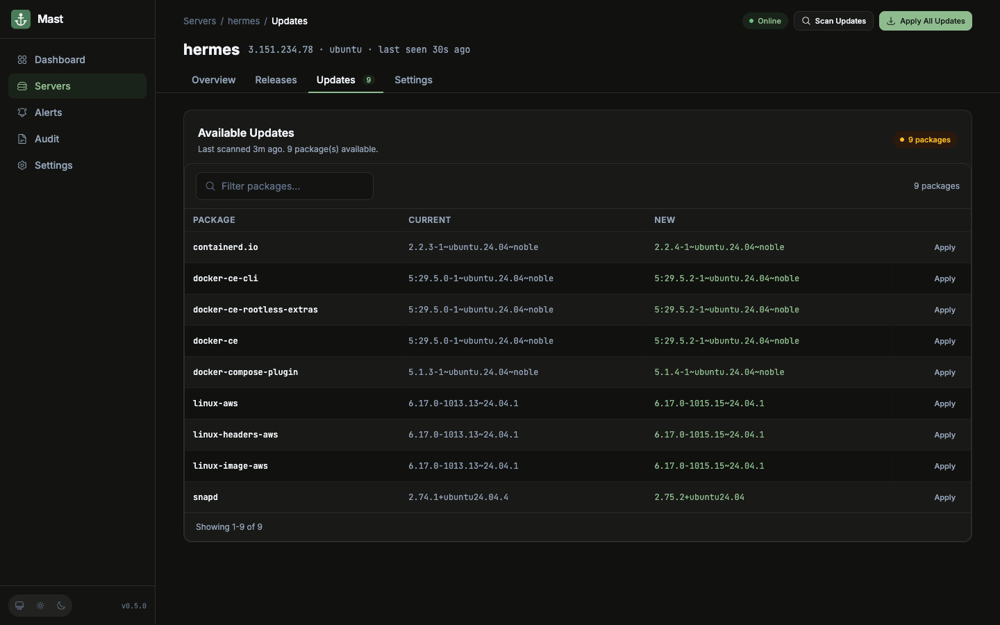
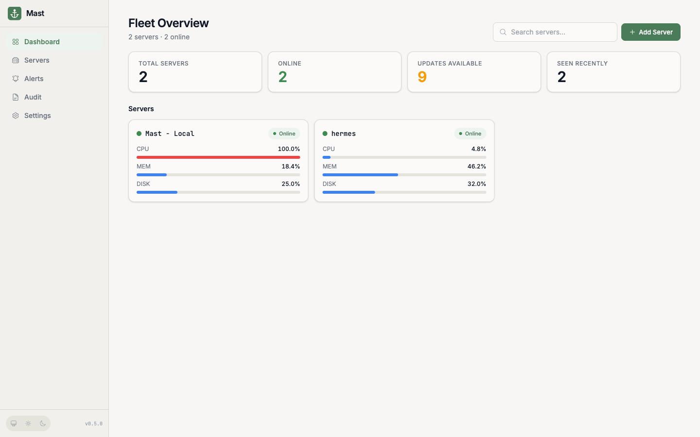
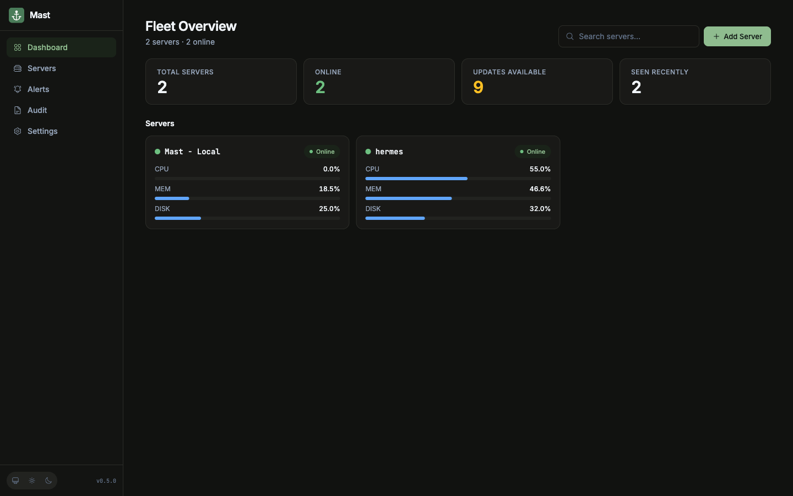
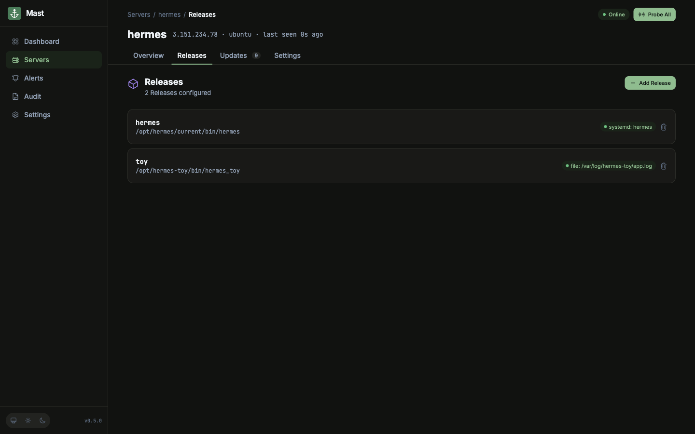
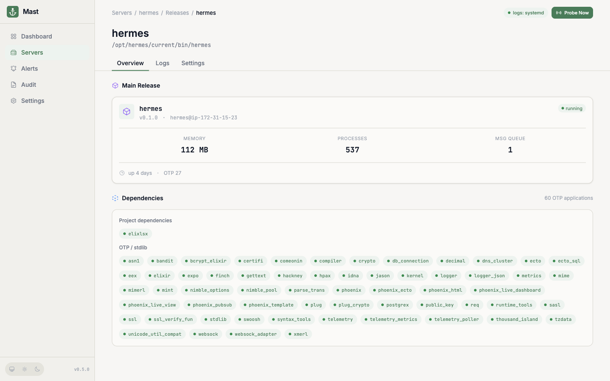
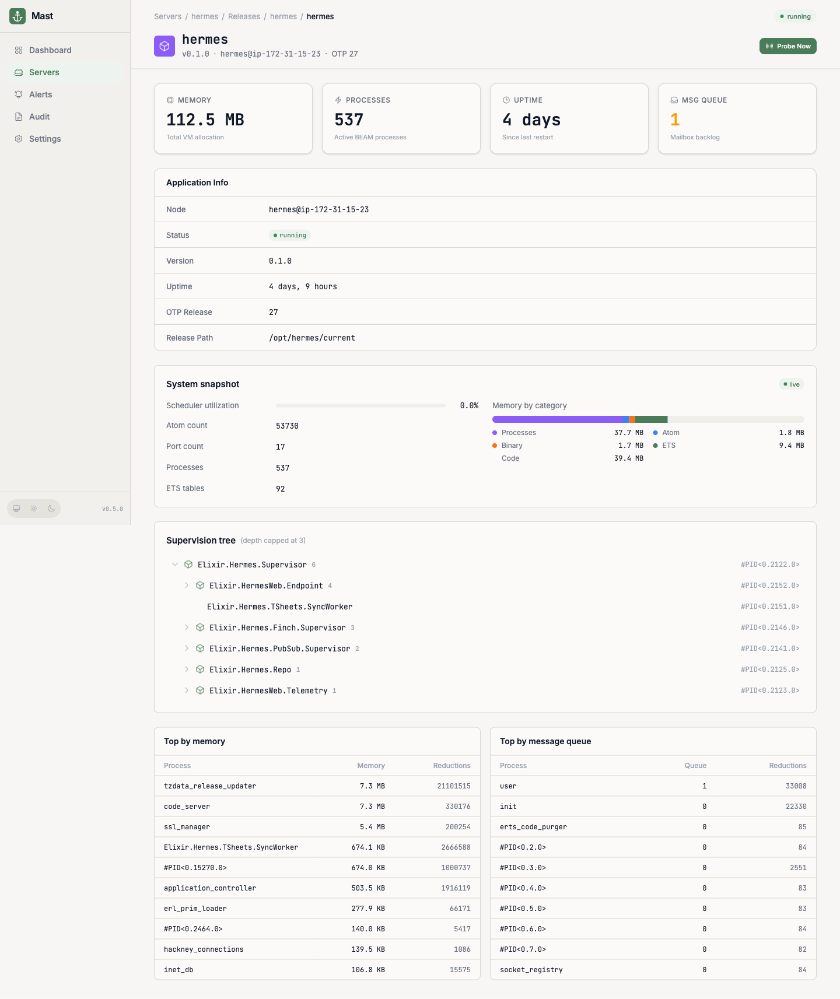

# Mast

[](https://github.com/pachev/mast/actions/workflows/ci.yml)
[](https://elixir-lang.org)
[](https://www.phoenixframework.org)

A small self-hosted dashboard for tracking a personal fleet of Linux
servers and the Elixir releases running on them. Phoenix 1.8 / Elixir 1.19
/ OTP 28. Built first and foremost for me, running as a systemd service
on an Ubuntu LXC in my Proxmox [home lab](https://pachevjoseph.com/lab).

## About this project

I built Mast to solve a problem I had. Most of the design decisions are
mine, but only roughly 15% of the code is hand-written; the rest was
generated by Claude Code under my direction. It works well for my setup
and I plan to keep adding features at my own pace. PRs are welcome.
Please keep the above in mind before relying on it for anything critical.
I do not want to oversell what this is.

Mast uses [mise](https://mise.jdx.dev) for tool management and as its
task runner; installing it first will make everything below smoother.
Deploying to your own box is covered in [docs/deploying.md](docs/deploying.md).

| | |
|---|---|
|  |  |

## Who this is for

People who run a handful of Linux boxes — usually Ubuntu, Debian or
Amazon Linux — that host their own Elixir/BEAM apps, and want one place
to see "are they up, do they need patches, are the apps healthy."

## Who this isn't for

If you need a full PaaS with git-push deploys, Docker app management, or
a polished generic agent-based fleet tool, you'll be happier with
[Coolify](https://coolify.io) or [Beszel](https://beszel.dev). Mast is
intentionally narrow:

- No host-side agent. SSH + the BEAM is enough (see ADR 0005).
- No deploy pipeline, no proxy management, no preview environments.
- App monitoring is **Elixir-first**. Distributed Erlang gives us better
  signal than HTTP probes, but you have to be running BEAM to get it
  (see ADR 0004). Plain HTTP fallback is planned, not a focus.

So: simple monitoring, security updates, and Elixir/BEAM-aware uptime.
If you don't fit that, the tools above are better.

## What works today

| | |
|---|---|
| Register servers with a name, host, ssh user, port | v0.1 |
| Beszel-style dashboard at `/` with CPU / Memory / Disk per box | v0.1 |
| Per-row **Check** button to run an SSH probe on demand | v0.2 |
| Background heartbeat every 30 s (dev) / 60 s (prod) | v0.2 |
| OS detection + package-manager mapping | v0.2 |
| Weekly OS patch scan via Oban cron (apt + dnf) | v0.2 / v0.5 |
| Per-server detail page at `/servers/:id` | v0.3 |
| **Apply All Updates** + per-package Apply with live shell streaming | v0.3 |
| Auto-rescan after a successful apply | v0.3 |
| SSH private keys stored encrypted at rest, used per-server | v0.4 |
| Key dropdown in the Add System modal (selects from registered keys) | v0.4 |
| App monitoring: list running Elixir releases per host, refresh on demand | v0.4 |
| Fleet-wide `/apps` view and per-app detail page at `/apps/:id` | v0.4 |
| Append-only audit log of every meaningful action (keys, servers, scans, applies) | v0.5 |
| `/audit` page with search + event/subject filters | v0.5 |
| Per-server Recent Activity panel on the detail page | v0.5 |
| Inline "Paste new key" form in the Add Server modal | v0.5 |
| Load average from `/proc/loadavg` (1m / 5m / 15m) | v0.5 |
| Stat tiles show used/total for memory and disk, with progress bars | v0.5 |
| New servers get an immediate connection check instead of waiting for the cron tick | v0.5 |

## Screenshots

Fleet overview (light and dark):

| | |
|---|---|
|  |  |

Elixir releases running on the box:



Per-release overview (uptime, memory, scheduler load, top processes):



OTP application deep dive powered by `:observer_backend`:



### Supported distros

Patch scanning is implemented for two package managers today:

- **apt** — Ubuntu, Debian, Raspberry Pi OS, and apt derivatives (Pop!_OS,
  Linux Mint, Zorin).
- **dnf** — Amazon Linux 2023, Fedora, Rocky, RHEL, Oracle Linux,
  AlmaLinux, CentOS.

The fleet dashboard, SSH probe, metrics, and app monitoring work on any
Linux box reachable over SSH; only the patch-scan and apply paths are
package-manager specific. Pacman, apk, and zypper are mapped but not yet
implemented.

For AL2023 specifically, Mast tracks the per-package update stream
(`dnf check-update`). Whole-distro release-version bumps
(`dnf upgrade --releasever=...`) are a separate signal we don't surface
yet, see [issue #13](https://github.com/pachev/mast/issues/13).

Validated end-to-end against a real Ubuntu 24.04 box and an Amazon Linux
2023 box: SSH probe → metrics refresh, patch scan finding real packages,
`apt upgrade -y` streamed live, encrypted key round-tripped through the
DB and used to dial production.

## Running locally

Requires [mise](https://mise.jdx.dev) and Docker.

```sh
mise install          # Erlang 28 + Elixir 1.19
mise run db:start     # Postgres in docker on localhost:7544
mise run setup        # mix deps.get + ecto.setup
mise run dev          # mix phx.server
```

Then open <http://localhost:4000>.

### Adding your first SSH key

Mast does **not** read `~/.ssh/config`. The simplest path: click **Add
Server**, expand the **Add new key** disclosure under the key dropdown,
paste a PEM, name it, save. The key is parsed, fingerprinted, and
stored encrypted (AES-256-GCM via Cloak) before the server is created.

You can also seed a key from IEx if you're scripting setup:

```elixir
{:ok, _} = Mast.Keys.create_key(%{
  name: "elpajo prod",
  body: File.read!("/path/to/your.pem")
})
```

Passphrase-protected PEMs are rejected at upload time — generate a
separate unencrypted key for Mast and authorize it on the target box
(the "deploy key" pattern). See ADR 0006 for the reasoning.

### Encryption key

`MAST_VAULT_KEY` is required in production. It must decode to exactly 32
bytes (AES-256-GCM). Generate one once and put it in your secrets
manager:

```sh
openssl rand -base64 32
```

The app refuses to boot if the variable is missing, not valid base64, or
does not decode to 32 bytes.

Dev/test use committed fallback keys (these aren't secrets — the dev DB
has no real data).

### sudo

The configured SSH user must be `root` or have passwordless `sudo` for
the host's package manager (`apt-get` on Debian/Ubuntu, `dnf` on AL2023
and Fedora-family). The workers prefix `sudo -n ` to those commands; if
sudo requires a password, scans and applies will fail silently.

Mast also reads logs through `sudo -n` (see ADR 0008). The SSH user
needs NOPASSWD entries for the commands that back each Log Source:

```
# /etc/sudoers.d/mast
ubuntu ALL=(root) NOPASSWD: /usr/bin/journalctl -u *
ubuntu ALL=(root) NOPASSWD: /usr/bin/tail -n 200 -F /var/log/myapp/*
ubuntu ALL=(root) NOPASSWD: /usr/bin/tail -n 200 -F /var/log/hermes-toy/*
```

Notes:

- One rule per `tail` path is the right shape. Wildcarding `tail -F *`
  hands any reader of that user account a read primitive across the
  whole filesystem, which is a foot-gun.
- `journalctl -u *` is broader than the apt entries because Mast does
  not know the unit name at sudoers-write time. It is bounded to read
  operations on the journal.
- Without these entries, the Logs tab will show `sudo: a password is
  required` in the stream and stop. That's a louder failure than
  silently empty output, which is by design.

## Making your Elixir app monitorable

Mast monitors Elixir applications by invoking
`bin/<release> rpc <expression>` over the existing SSH connection. The
expression runs inside your release's BEAM, reads
`:application.which_applications/0`, and returns a JSON payload. One SSH
roundtrip per probe, no extra ports, no cookies for mast to manage. See
[ADR 0004](docs/adr/0004-elixir-native-monitoring.md) for the rationale.

For this to work, your mix release needs three things:

### 1. Short-name distribution

Mix release defaults to long-name distribution (`-name <release>@<host>`),
which expects `hostname -f` to return a fully qualified domain name. On
most cloud VMs (EC2, GCE, fly.io machines), `hostname -f` returns a short
name like `ip-172-31-15-23` and the BEAM refuses to form the node. That
breaks `bin/<release> rpc` and any tool that wants to attach.

Switch to short-name distribution by creating `rel/env.sh.eex` in your
project:

```sh
#!/bin/sh
export RELEASE_DISTRIBUTION=sname
export RELEASE_NODE=<your_app_name>
```

`mix release` picks this up automatically on the next build and ships it
inside the release. After deploying and restarting, `bin/<app> rpc` works
in under a second:

```sh
$ time /opt/myapp/current/bin/myapp rpc 'IO.inspect(:pong)'
:pong
real    0m0.31s
```

If your host already has a proper FQDN (`hostname -f` returns something
like `myhost.internal.example.com` that resolves back to the same IP),
you can keep long names. Short names are simpler and the default mix
release tooling assumes them.

### 2. `runtime_tools` in `extra_applications`

The per-app detail view (scheduler load, supervision tree, top processes
by memory and message queue) is powered by `:observer_backend`, which
ships with OTP's `runtime_tools` application. New projects from
`mix phx.new` already include it, but if your release was started from a
bare `mix new` template you may need to add it:

```elixir
# mix.exs
def application do
  [
    mod: {MyApp.Application, []},
    extra_applications: [:logger, :runtime_tools]
  ]
end
```

Without `:runtime_tools`, mast still shows the scalar stats from the
regular probe (memory, processes, uptime, message queue) and the
per-app page surfaces a small banner pointing back here. Adding it
unlocks the richer Observer-style sections.

### 3. Wire the release path into mast

On the server's detail page in mast, open the **Settings** tab and set
**Release command** to the absolute path of your release's
`bin/<app>` script, e.g. `/opt/hermes/current/bin/hermes`. Mast will
probe it every 30 seconds and surface results on the **Apps** tab and
the fleet-wide `/apps` page.

That's the whole integration — no agent to install, no metrics endpoint
to expose, no port to open beyond SSH.

## Testing

```sh
mise run test
```

The test suite uses `Mast.SSH.Stub` and does not touch the network.

## More

- [`docs/adr/`](docs/adr/README.md) — architecture decisions. Start here
  to understand why anything is the way it is.
- [`CLAUDE.md`](CLAUDE.md) — conventions and guardrails for AI agents
  (and humans).
- GitHub issues on this repo are the canonical task tracker for
  follow-up work.

## License

MIT. See [LICENSE](LICENSE).

